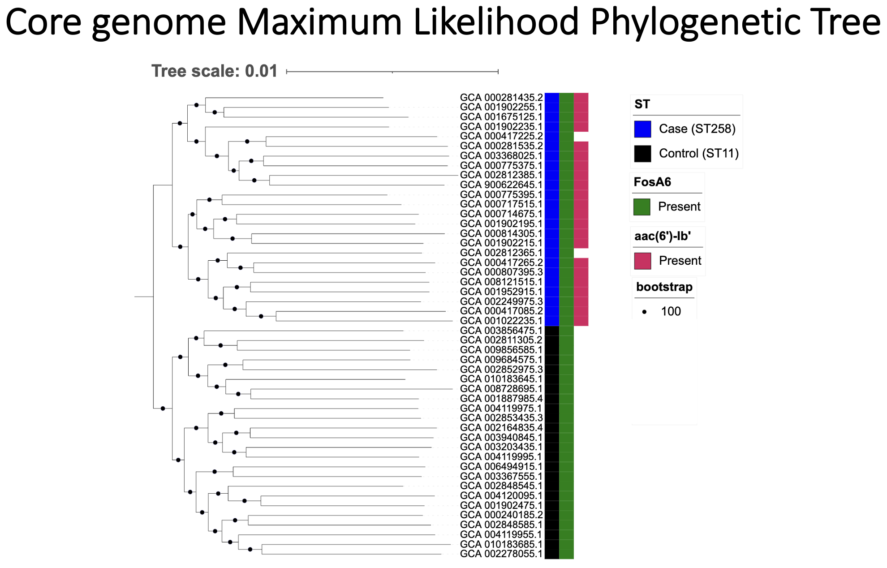

# Microbial Genomics Journey Workshop 2023
## Session 12: Graduation Project
### Description
* There will be 3 teams (Red, Green and Blue). Each team will work together on a project with certain comparative genomics questions to try to answer. We talked about too many tools and approaches, this project will be the most important part of the workshop as you will be able to apply what you have learnt so far and put it all together.
* The last session will be on 5/10 and each team will present their findings. Next Wednesday you will get more details.
* You can access teh dataset from [Dataset of 50 genomes](https://www.dropbox.com/scl/fo/j8fajbwm5cwfy14l9nasc/h?dl=0&rlkey=531bwej0dxzxoq2k04kllthi9).
* There is a fastq folder with 50 genomes and 1 file showing case and control designations.
* Each team will have to present their methods, main commands and major findings on 5/10/2023.
* The teaching team will be happy to answer all your questions.

### Thoughts and Tips
* Go through the material and you will be able to process these isolates from start to finish. You may not use all of the tools.
* The readme file on github with the syllabus has a nice summary for all steps and tools we discussed.
* Team should divide work. For instance, each one assemble 5 genomes...etc, using the same command.

### Questions to answer
These 50 genomes are from a single species. There are two group of isolates (case and control), 25 each. You are provided with fastq reads files.
1. What are the differences between the genomes in the case group vs control group?
2. Build a phylogenetic tree for these 50 genomes. Describe your findings on the tree!

### Solution
**QC**<br/>
**FASTQC**
```
cat GCA_000775395.1_R1.fastq.gz GCA_000775395.1_R2.fastq.gz > GCA_000775395.1_combined.fastq.gz
conda activate fastqc2
fastqc GCA_000775395.1_combined.fastq.gz
```

**Assembly**<br/>
```
../snippy_convert_list_input_tab.py ../accs.txt ../spades_bash.sh
chmod +x spades_bash.sh
./spades_bash.sh
spades.py --pe1-1 GCA_905128515.1_R1.fastq.gz --pe1-2 GCA_905128515.1_R2.fastq.gz -o assem_GCA_905128515.1
```

**MLST**
```
mlst --csv *.fasta > ../all_mlst.csv
```

**QC**<br/>
**BUSCO**
```
conda activate busco
snippy_convert_list_input_tab.py accs.txt busco_bash.sh
chmod +x busco_bash.sh
cd assemblies
./busco_bash.sh
```
**mash**<br/>
**good example**
```
mash screen -w -p 8 /Users/moustafaam/Downloads/refseq.genomes.k21s1000.msh assemblies/GCA_000717515.1.fasta > GCA_000717515.1_mash.txt
sort -gr GCA_000717515.1_mash.txt > GCA_000717515.1_mash_sorted.txt
```
**contamination example**
```
mash screen -w -p 8 /Users/moustafaam/Downloads/refseq.genomes.k21s1000.msh assemblies/GCA_001068065.1.fasta > GCA_001068065.1_mash.txt
mash screen -w -p 8 /Users/moustafaam/Downloads/refseq.genomes.k21s1000.msh assemblies/GCA_905128515.1.fasta > GCA_905128515.1_mash.txt
sort -gr GCA_001068065.1_mash.txt > GCA_001068065.1_mash_sorted.txt
sort -gr GCA_905128515.1_mash.txt > GCA_905128515.1_mash_sorted.txt
```
**These two genomes were excluded from the next steps.**

**Annotation**
```
chmod +x copy_rename_files_prokka.py
./copy_rename_files_prokka.py
../snippy_convert_list_input_tab.py ../accs.txt prokka_bash.sh
conda activate prokka
chmod +x prokka_bash.sh
./prokka_bash.sh
prokka --outdir annotations/annot_GCA_003203435.1 --kingdom Bacteria --locustag GCA_003203435.1 --prefix GCA_003203435.1 assemblies/GCA_003203435.1.fasta
```

**pangenome**
```
find ./ -name '*.gff' -exec cp -prv '{}' '/Users/moustafaam/MGJW/final_project/fastq/gff' ';'
conda activate panaroo_m2
cd gff
panaroo -i *.gff -a core --aligner mafft -t 8 -o panaroo_results_align/ --clean-mode strict
```

**GWAS**<br/>
**Scoary**
```
scoary -t isolates.csv -g gene_presence_absence_roary.csv
```
There are 23 genes that are only present in the 24 isolates in the case group (100% specificity and sensitivity).<br/>

**ABRICATE**
```
for f in assemblies/*.fasta; do abricate $f > $f.tab ; done
abricate --summary *.tab > abricate_summary.tab
```

**phylogeny**
```
iqtree -s core_gene_alignment_filtered.aln -T 64 -m HKY -B 1000
```

**Visualization**<br/>
The iqtree program outputs a bunch of files, the core_gene_alignment_filtered.aln.contree can be opened in [Itol](https://itol.embl.de/tree/163116135115285751683734250#) or Figtree, and it includes the branch support values. I used two genes from the Abricate output and ST designation from the MLST step to show on the tree.


## Further Readings
* [PATRIC](https://www.bv-brc.org/)Bacterial and Viral Bioinformatics Resource Center (BV-BRC). BV-BRC is a joint effort among the University of Chicago (UChicago), J Craig Venter Institute (JCVI), Fellowship for Interpretation of Genomes (FIG), and University of Virginia (UVA) that provides a web-based information system designed to support the biomedical research community’s work on bacterial and viral infectious diseases via integration of vital pathogen information with rich data and analysis tools. BV-BRC combines the data, technology, and extensive user communities from two long-running centers: PATRIC, the bacterial system , and IRD/ViPR, the viral systems.
* [KBase](https://www.kbase.us/) is the first large-scale data science platform that enables users to upload their own data, analyze it alongside collaborator and public data, build increasingly realistic models, and share and publish reproducible workflows and conclusions.
* [Galaxy](https://usegalaxy.org/) is an open source, web-based platform for data intensive biomedical research.
