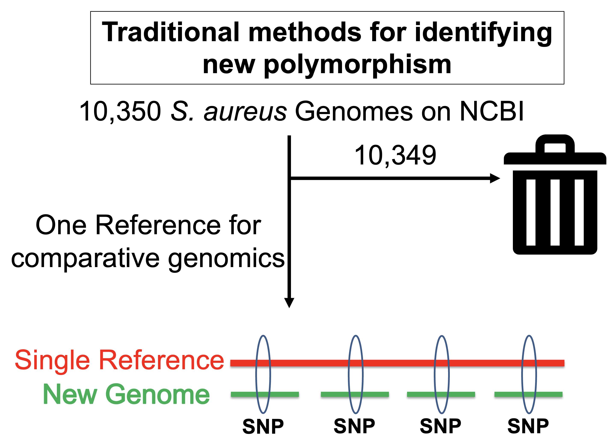
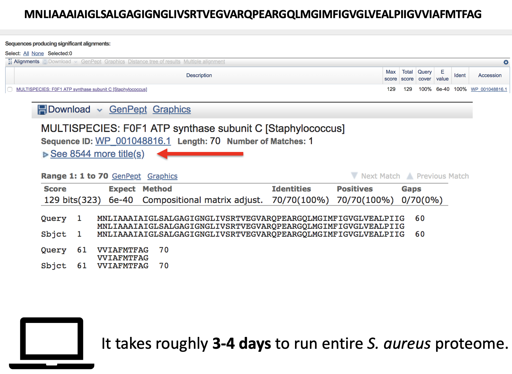
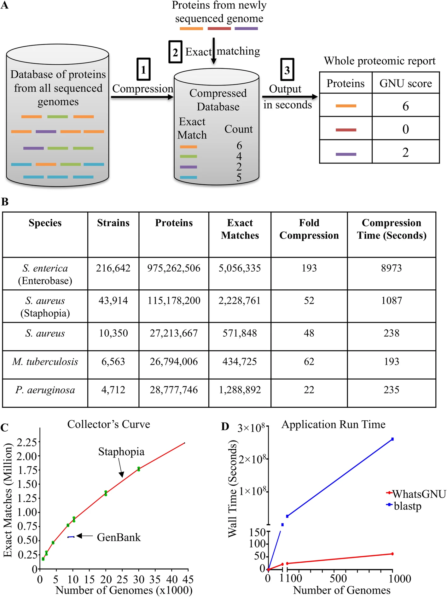
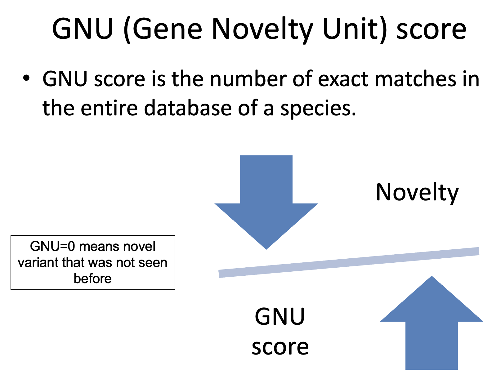
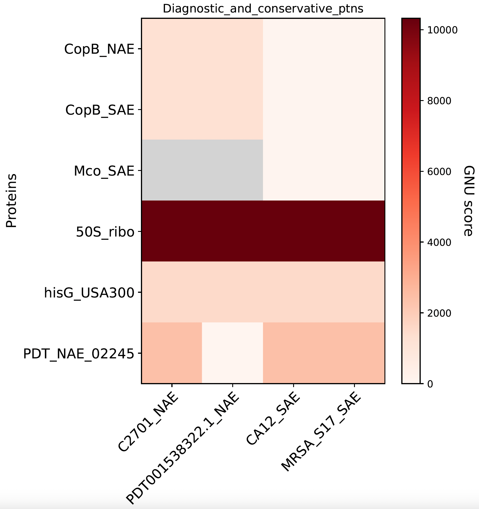
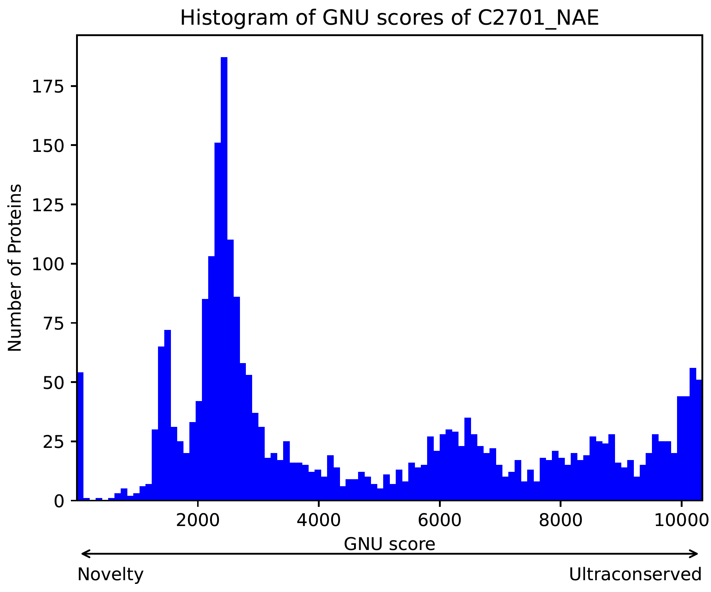
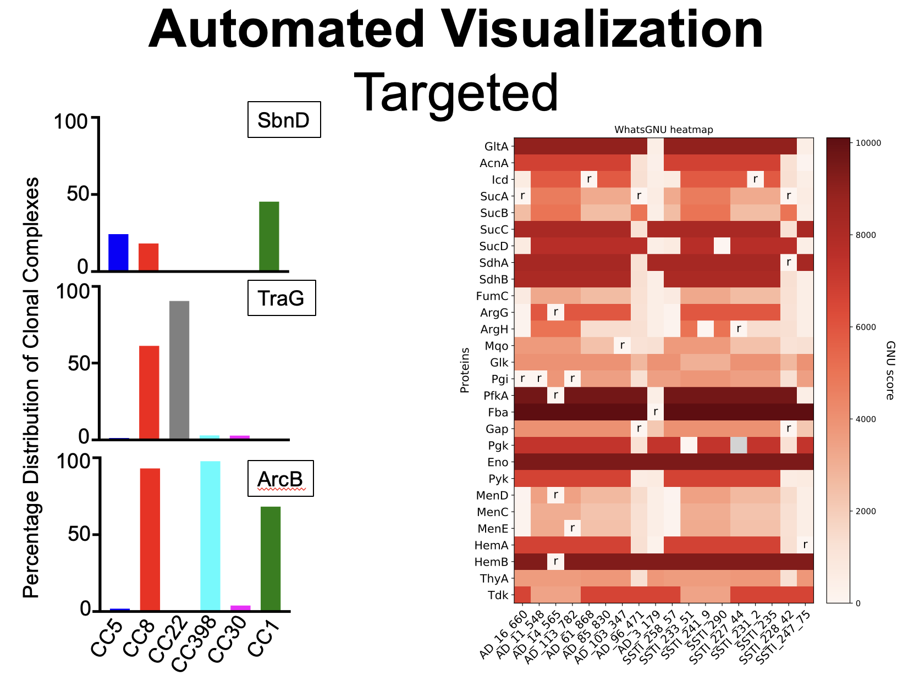
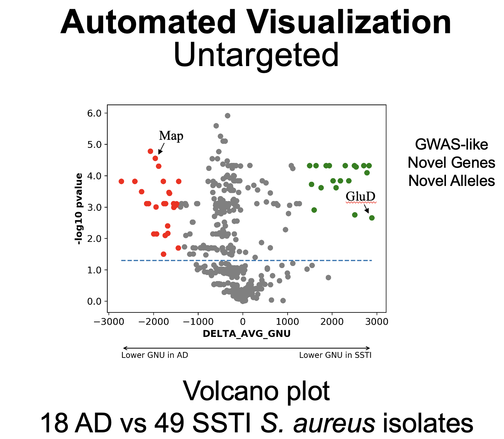

# Microbial Genomics Journey Workshop 2023
## Session 8: Panallelome analysis
With the rapid growth of genomic databases and reduced sequencing costs, scalable tools are essential for categorizing, classifying, and measuring genomic novelty. Traditional methods, which use single reference sequences for comparison, have limitations in identifying polymorphisms. Using multiple references or the entire database of reference genomes can be computationally challenging.<br/>

**Are the identified polymorphisms rare or widespread in the natural variation of the species?**<br/>

To address this issue, blast can be used. Let's look at this blast output. However, this will take days to run for one genome.


To fill this gap, the WhatsGNU tool was developed. It quickly calculates the gene novelty unit (GNU) score for each protein across a genome, which counts the exact protein sequence matches for a given protein allele in the database. It also provides various comparative graphs for publication-quality figures. When combined with orthology information, WhatsGNU can also be used to link pangenomic and panallelomic analyses.<br/>

## WhatsGNU
[WhatsGNU](https://github.com/ahmedmagds/WhatsGNU) is a tool for identifying proteomic novelty. WhatsGNU utilizes the natural variation in public databases to rank protein sequences based on the number of observed exact protein matches (the GNU score) in all known genomes of a certain species & can quickly create whole protein reports. WhatsGNU compresses proteins database based on exact match to much fewer number of proteins that differ by at least one amino acid. Six precompressed databases (.pickle) are available to download and use:
Ortholog Mode:
* Klebsiella pneumoniae Version: 04/17/2020 (compressed 46,072,343 proteins in 8752 genomes to 1,466,934 protein variants).
* Mycobacterium tuberculosis Version: 07/09/2019 (compressed 26,794,006 proteins in 6563 genomes to 434,725 protein variants).
* Pseudomonas aeruginosa Version: 07/06/2019 (compressed 14,475,742 proteins in 4712 genomes to 1,288,892 protein variants).
* Staphylococcus aureus Version: 06/14/2019 (compressed 27,213,667 proteins in 10350 genomes to 571,848 protein variants).
Big Data basic Mode:
* Salmonella enterica Enterobase Version: 08/29/2019 (compressed 975,262,506 proteins in 216,642 genomes to 5,056,335 protein variants).
* Staphylococcus aureus Staphopia Version: 06/27/2019 (compressed 115,178,200 proteins in 43,914 genomes to 2,228,761 protein variants).


### WhatsGNU toolbox
#### WhatsGNU_get_GenBank_genomes.py
This script downloads genomic fna files or protein faa files from GenBank.

#### WhatsGNU_database_customizer.py
This script customizes the protein faa files from GenBank, RefSeq, Prokka and RAST by adding a strain name to the start of each protein. This script can also customize the strain names for gff file to be used in Roary for pangenome analysis, if the Ortholog mode is going to be used in WhatsGNU.

#### WhatsGNU_main.py
* It takes **.faa** protein FASTA files as input. It can take one file as an input or a folder of multiple files.
* In basic mode, this script ranks protein sequences based on the number of observed exact protein matches (the GNU score) in all known genomes of a particular species. It generates a report for all the proteins in your query in seconds using exact match compression technique.
* In ortholog mode, the script will additionally link the different alleles of an ortholog group using the clustered proteins output file from Roary or similar pangenome analysis tools. In this mode, WhatsGNU will calculate Ortholog Variant Rarity Index (OVRI) (scale 0-1). This metric is calculated as the number of alleles in an orthologous group that have a GNU score less than or equal to the GNU score of any given allele divided by the sum of GNU scores in the orthologous group. This index represents how unusual a given GNU score is within an ortholog group by measuring how many other protein alleles in the ortholog group have that GNU score or lower.<br/>

For instance, an allele of GNU=8 in an ortholog group that has 6 alleles with this distribution of GNU scores [300,20,15,8,2,1] will get an OVRI of (8+2+1)/346= 0.03. On the other hand, the allele with GNU=300 will get an OVRI of (300+20+15+8+2+1)/346= 1. An allele with an OVRI of 1 is relatively common regardless of the magnitude of the GNU score, while an allele with OVRI of 0.03 is relatively rare. This index helps distinguish between ortholog groups with high levels of diversity and ortholog groups that are highly conserved.

#### WhatsGNU_plotter.py

This script plots:
* Heatmap of GNU scores of orthologous genes in different isolates.
* Metadata distribution bar plot of proteins.
* Histogram of the GNU scores of all proteins in a genome.
* Volcano plot showing proteins with a lower average GNU score in one group (case) compared to the other (control). The x-axis is the delta average GNU score (Average_GNU_score_case – Average_GNU_score_control) in the ortholog group. Lower average GNU score in cases will have a negative value on the x-axis (red dots) while lower average GNU score in the control group will have positive value on the x-axis (green dots). The y-axis could be drawn as a -log10(P value) from Mann–Whitney-Wilcoxon test. In this case, lower average GNU score in one group (upper left for case or upper right for control) would be of interest as shown by a significant P value (-log10( P value) > 1.3). The y-axis can also be the average OVRI in the case group for negative values on the x-axis or average OVRI in the control group for positive values on the x-axis.
Let's Try WhatsGNU!

### Installation
```
mamba create -n whatsgnu -c bioconda whatsgnu
conda activate whatsgnu
```
### Usage
* Download the S. aureus database. I use here an ortholog database which links pangenome with panallelome.
```
cd ~/MGJW
mkdir WhatsGNU_db
cd WhatsGNU_db
wget -O Sau.zip https://www.dropbox.com/sh/p292mia4oc99hx6/AACPuv7uoYUkZ1WCBDX0XPSVa?dl=0 --no-check-certificate
unzip Sau.zip -d WhatsGNU_Sau_Ortholog
```

* We will use the 4 NAE and SAE genomes from last session. As these genomes from last session are not annotated. The first step is to annotate the genomes using Prokka using a command like
```
prokka --outdir MRSA_S17_SAE --kingdom Bacteria --locustag MRSA_S17_SAE --prefix MRSA_S17_SAE MRSA_S17_SAE.fna
```

* Check Proteomic Novelty for some genomes. Make a directory and put all 4 faa files in it. Use this command to run WhatsGNU.
```
WhatsGNU_main.py -d WhatsGNU_Sau_Ortholog/Sau_Ortholog_10350.pickle -dm ortholog faa/
```
* You can all use multiple features of WhatsGNU in a simple command like This
```
WhatsGNU_main.py -d WhatsGNU_Sau_Ortholog/Sau_Ortholog_10350.pickle -dm ortholog -o WhatsGNU_results_all_fn -t -e WhatsGNU_Sau_Ortholog/metadata_frequency.csv -f -b faa/
```
Let's explore the output files. You will get 3 files for each genome with the previous command.
* _report.txt --- tab-separated output file showing the GNU score for each individual protein in the genome.
* _topgenomes.txt --- top 10 genomes with hits to your query`less C2701_NAE_WhatsGNU_topgenomes.txt`
* _zeros.faa --- file of all proteins with GNU score of zero



#### Automated Visualization - Targeted - Heatmap
```
WhatsGNU_plotter.py -hp ortholog -q heatmap_ptns.faa -r -t Diagnostic_and_conservative_ptns -r -f 14 -fs 14 10 NAE_SAE_hp WhatsGNU_reports/
```

#### Automated Visualization - Untargeted - Histogram
```
WhatsGNU_plotter.py -x -e blue -b 100 -p 50 5000 NAE_SAE WhatsGNU_reports/
```

#### Automated Visualization - Untargeted - Volcano plot
```
WhatsGNU_plotter.py -st isolates_case_control_tag.csv -c 100 NAE_SAE_volcano WhatsGNU_reports/
```
### Some plots from the WhatsGNU paper



## Further Readings
* [WhatsGNU Publication](https://genomebiology.biomedcentral.com/articles/10.1186/s13059-020-01965-w)
* [An example of using WhatsGNU to evaluate the sequence conservation](https://elifesciences.org/articles/66657)
* [Pre-epidemic evolution of the MRSA USA300 clade and a molecular key for classification](https://www.frontiersin.org/articles/10.3389/fcimb.2023.1081070/full)
